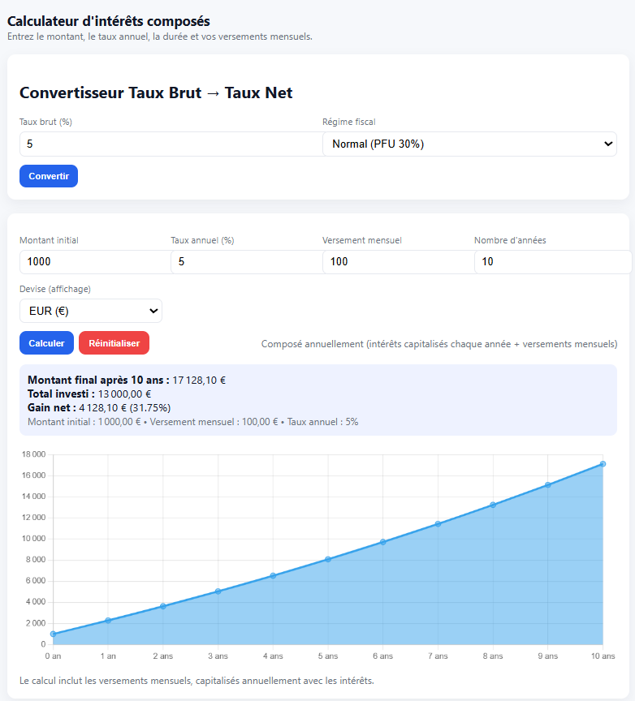

# Interest-calculator-html-chatGPT
An interest calculator webpage made ENTIRELY by chatgpt to test IA progress. It is a single html file, able to transform normal % to % after tax, as well as a graph and a calculator.

This webpage was entirely made by chatgpt, without me correcting it. It worked first try, i've added a few fonctionnality one after another and everything worked from the start.
It was using the regular free plan under chatgpt 5.

## Table of Contents

* [🔧 Installation](#-installation)
* [💡 Usage](#-usage)
* [✨ Features](#-features)
* [🛠️ Tech Stack](#️-tech-stack)
* [📸 Screenshots](#-screenshots)
* [🤝 Contributing](#-contributing)
* [✉️ Contact](#️-contact)
* [📄 License](#-license)

---

## 🔧 Installation

1. **Clone the repository**

   ```bash
   git clone https://github.com/DaemoniaX/Interest-calculator-html-chatGPT.git
   ```
2. **Install dependencies**

   none
   
3. **Serve locally**

   Click to open the HTML file.

## 💡 Usage

* Transform regular interest rate to an after-tax one, for france, with the tax between regular 30% or PEA 17%.
* Calculate composed interest on a fixed amout, a first deposit followed by an increase of balance using DCA, and return how much you will get after the entered number of years.

---

## 🛠️ Tech Stack

* **Language**: HTML

---

## 📸 Screenshots

---


---

## 🤝 Contributing

Contributions, issues and feature requests are welcome! Please feel free to:

* Fork the repository
* Create an issue for bugs or enhancements
* Submit a pull request

---

## ✉️ Contact

**Name**: Antonin Marolleau  
**School**: ESIEE Paris – Integrated Engineering Program second year  
**Email**: [antonin.marolleau@edu.esiee.fr](mailto:antonin.marolleau@edu.esiee.fr)  
**LinkedIn**: [https://www.linkedin.com/in/antonin-marolleau-7b5497339](https://www.linkedin.com/in/antonin-marolleau-7b5497339)  

---

## 📄 License

This project is licensed under the CC0 License.

